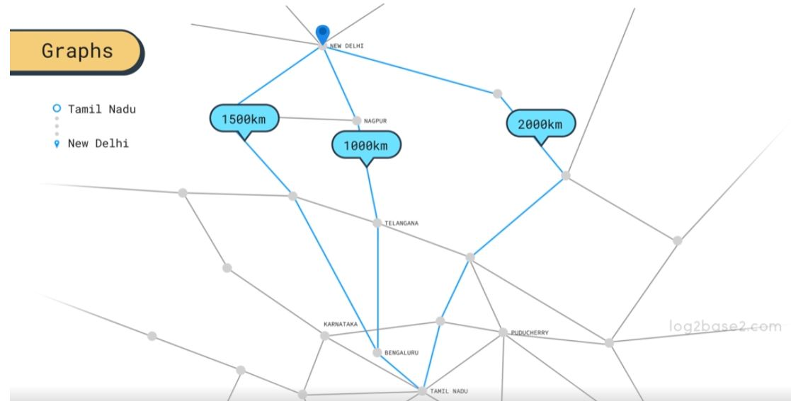

## Algorithms

### What is Algorithm

- The word ==“algorithm”== is actually derived from a Latinized version of Al-Khwarizmi’s name.

- ==well-defined computional procedure take an input(value or set of values) and transforms that to desired output in a finite amount of time==.
  - Computational problem. Such as Decision, Search, Counting and Optimization problems
  - Tip: Any procedure(function) is an algorithm, but in CS we typically mean computational problems
- Algorithm may be correct or incorrect depending on desired output, but efficieny play an important role.(cost, temperature server)

###### Little History: The father of Algorithm

- Muḥammad ibn [`Mūsā al-Khwārizmī`](https://www.lowellmilkencenter.org/programs/projects/view/muhammad-ibn-musa-al-khwarizmi/hero) was a Persian polymath(عالم فارسي متعدد العلوم)
- produced vastly influential works in `mathematics`, `astronomy`, and `geography`
- presented `the first systematic solution` of `linear and quadratic equations` (_algorithms_)
- considered the `founder of algebra`

- The word **“algebra”** is drawn from a portion of the title of his most famous book, (كتاب المختصر في حساب الجبر والمقابله), translated as The Compendious Book on Calculation by Completion and Balancing and otherwise known as Al-Jabr.


> "When I consider what people generally want in calculating, I've found that is is always a number."

```
Even if you’re not looking at complex mathematical formulas
every day, you’re surrounded by them. Algorithms covertly
drive even our most routine daily activities like taking an
UberPool, using Spotify Discover playlists and typing something on Google.
```

Therefore, it behooves you to understand algorithms not just as a student or
practitioner of computer science, but as a citizen of the world. Once you understand
algorithms, you can educate others about what algorithms are, how they operate,
and what their limitations are.

#### simple calculator

- Do you remember your first calculator program?
  - It was most likely a simple one
  - Read an expression of 2 numbers: e.g. 51.7+ 12
- Possible operations: + - \* /
  - Be careful about division by zero
  - Numbers might not be separated from the operator (see example)
- Many projects, such as that one, or similar ones like building a hospital system, involve a specific skill
  From code to requirements.
- The main art is your design and implementation skills
  - This could be very challenging!


#### Advanced calculator

- Let’s build a more complex calculator
  - The expression may have several numbers
  - Operators: + - \* / and also ^ (power)
  - Parentheses: ( )
- Now, how can you compute the answer?
  - 2+1*5: mathematically, this is 7, NOT 3*5 = 15
  - What about: 2+7×(1+2×(3^2^4−3)) ?
    - 3^2^4 = 3 ^ 16 NOT 9^4
    - () must be applied first
- Hmm: you can’t just translate requirements!
  - There is a part involving unusual thinking style!
  - It involves more computations


#### Algorithmic Thinking

- To correctly solve the expression: 2+7×(1+2×(3^2^4−3))
  - We need a careful step-by-step approach to evaluate correctly
- Mathematically : consider the associativity (left to right?) and precedence (\* vs +)
- Overall: it takes good deal of thinking to get it right
  - [Edsger Dijkstra](#) is a popular Dutch computer scientist.
  - He invented: the [shunting-yard]() algorithm
    - a step by step procedure that can solve this challenge
- First, he converted this expression (we call it infix) to another structure (we call it postfix)
- Then, evaluating the new structure is an easy task
- Both tasks also made use of the stack data structure

#### More Challenges!

● Given 1000 integers, find how many combinations of three numbers add up
to make 400? E.g. 100+160+140
○ We can do 3 loops to try every set of 3 numbers!
○ Hmm..1000000000 operations! Far too many computations!
○ What if we have 10^6 numbers!
● Given 10^6 integers, can you sort them from small to large?
○ Hmm...nothing direct in mind!
● Given airport locations and the cost of every direct flight:
Can you find the cheapest route from, say, Cairo to New York?
○ Hmm...how can we represent the relationship between different airports?
● Facebook has ~3 billion users. Suggest to Mostafa all new friends such that
there are exactly 5+ common friends between Mostafa and each new friend?

### Performance

● In real life applications, we care about many factors
○ E.g. Usability, Security, Maintainability, Reliability, Scalability, etc
● One of the major factors is the performance
○ Efficiency for time and space (memory) are desirable features in all applications
○ Imagine if Facebook was a slow application! How can it be that efficient with such a huge
number of users?
● This is where the algorithms field play a crucial role!
○ But there are many other factors. Distributed systems are the major key.
○ Find an efficient computational solution. The criteria? Time and space constraints

### High performance real life apps


#### why we interseted in algorithms

**Daily life application**

- web browsers

- music players
- movie ticket booking apps
- autonomous driving
- etc.....



#### Algorithms content (مسائله)

- Sort & Search algorithms
- Graph algorithms (E.g. shortest path problem)
- Dynamic Programming & Greedy algorithms
- String algorithms (E.g. used in search engines to do matching)
- Game theory & Numerical algorithms
- Number-theoretic algorithms
- Combinatorial algorithms
- Computational geometric algorithms
- Note: We can’t solve every problem efficiently

#### Algorithms Analysis

- Given an algorithm, we need to:

  1. Prove its Correctness
  2. Measure time efficiency
  3. Measure space (memory) efficiency

- Steps 2 and 3 allow us to compare algorithms
  - Fall in a complementary area: Computational Complexity
- An example of sorting algorithms: time perspective
  - Selection sort algorithm: orders N numbers using N\*N operations
    - E.g. if N is 1000, it takes around ~10^6 operations
  - Quicksort algorithm: orders N numbers using N \* log2N operations
  - E.g. if N is 1000, it takes around ~10^4 operations
  - Then Quicksort is a faster algorithm

#### Other types of Algorithms

- Example: Machine Learning (ML) algorithms
  - Given an email, how can we know if it is a spam?
- Writing a huge amount of if/else conditions? No. Use ML
- Given an image, how can we identify the people inside it?
- If we can prepare a large dataset with input (e.g. email) to output (is spam?),
  we can learn from the data.
- Example: Genetic Algorithms
  - a heuristic search algorithm used to solve search and optimization problems
- In the industry, we should use the right tools for a problem. Without studying
  the different fields, you will be puzzled
  - Don’t be an ignorant CS graduate!

---

### Data Structure

- A data structure is a way to store and organize data in order to facilitate access and modifications.
- Using the appropriate data structure or structures is an important part of algorithm design.
- No single data structure works well for all purposes, and so you should know the strengths and limitations of several of them.

---

### Coding Interviews

- Many coding interviews are algorithmic-based.
- Most common in interviews: Sorting, Searching, Graph (DFS, BFS), Binary Search, Backtracking
- Less common: Greedy, Dynamic Programming, Divide and Conquer
- All data structure concepts are common in interviews

### Algorithmic-based projects

- Some projects are based on specific areas in algorithms
- For example, Google Maps must utilize a lot of graph algorithms to find the
  different routes from one location to another
  - From - To
  - The time
  - Transportation means: car, bus, train, etc
- Similar sub-areas exist in Twitter and Facebook to model relationships
- Cryptography utilizes concepts in number theory
- Some research projects utilize algorithms areas (Graph, Dynamic
  Programming, Greedy and the Approximations algorithm)

### General Software Project

- In 95% of careers, you won't need to code an algorithm by yourself
  - This includes most project in big companies, such as Google and Facebook
- Analogy: many of the exercises professional footballers perform in training are never directly used in real games, but they play a big role behind their skills!


### Learn many things on a small scale!

- Tackling computation problems teaches you many concepts
- Thinking about correctness of what we code
- Enumerating test cases including critical boundary cases
- Sharpens your thinking, coding, debugging and testing skills
- Strong sense of the efficiency of what you code
- Acting like a problem-solver
- Tackling a problem from several angles. Thinking about the trade-offs

### Algorithms and the CS core(نسبته)

- The CS community had a long journey building algorithms for many things
  - Compiler, interpreter, or assembler that are used behind the scenes eventually
- Routing in networks relies heavily on algorithms
- Operating systems scheduling algorithms
- Clipping algorithms in Graphics
- Encryption algorithms in Cryptography: (e.g. ElGamal encryption system)
- Recovery algorithms in Databases
- Pagerank algorithm in Search Engines
- Hungarian algorithm in tracks matching in Computer Vision
- Dynamic Programming for Markov decision process in Machine Learning

### Questioning algorithms importance nowadays!

● In the past, no one questioned the importance of algorithms!
● Nowadays, as we build on very high level languages, frameworks and
algorithmic libraries ⇒ some people question their importance
● You can build basic mobile app nowadays without many CS fundamentals!
● Solid computer science background is a fundamental key for a strong SWE
● During your journey you will certainly need to know the basics of algorithms!
● Tackling algorithmic challenges can be frustrating many times, but it is a
game-changer for your thinking mentality!
○ It is also fun for people who like to be problem solvers!

### Prerequisites

- Strong programming skills
  - A high-quality programming course consisting of:
  - Good coverage of programming + many exercises for all topics
  - Recursion: One of the hardest topics for most students
    - Example: Do you understand Fibonacci?
    - Many topics are based on it
    - I am providing a review from my programming course.
- STL Basics
  - Vector is the most used data structure during the course
- Optional but highly recommended
- A high quality Data Structure course: in-depth on the basics; with plenty of exercises
  - DS is somewhere between programming and algorithms in terms of difficulty
  - Students with strong DS skills find it easier to proceed in algorithms topics

---

### Studying Algorithms

- Algorithms course is one the hardest courses for most students!
- Here are the possible scenarios:
  - You don’t understand the algorithm itself.
    - Repeating the materials 2-3 times, or using alternative sources will resolve this
- You got the algorithm and its intuition, but you can’t understand the formal proof
  - I don’t present formal proofs in this course. You will do that on your own
  - You will give a trial. Keep going. Repeat later.
  - You got everything, but can’t solve non-trivial problems: this is the obstacle!
- People who love problem solving, puzzles, and mathematics find it a reasonable
  challenge
- Others may find it more difficult to proceed smoothly

### Gaining the skill: Fundamental facts!

- Problem-solving is NOT an easy skill to master
- It will be painful but fun
- It will take a lot of time and repetition
- You will even fail to re-solve a problem you solved before
- The process will change your mind totally
- You must be patient!
- You will have to repeat topics related to recursion a lot. This is normal!
- Make sure you have basic problem-solving skills from programming
- Optional but recommended; solve easy algorithmic problems
- You may use LeetCode website for that
- Or solve from my Interviews sheet
- Or solve from my competitions sheet if you target competitive programming

### Gaining the skill: Fundamental facts!

- Practice makes perfect!
  - Consistency is KEY! Stopping/Starting is INEFFECTIVE and INEFFICIENT, and leads to
    WEAK SKILLS.
- Make sure to dedicate 5-10+ hours weekly
- You must solve in the right way: you have to make an honest and earnest initial attempt
  - Never go to the solution without first making a SERIOUS attempt at the problem
    - Always approach learning with a positive attitude.
    - Dismiss doubts such as 'you can't do this'/'you're not good enough'

### A serious trial for solving

● A common highly wrong approach
○ Try the problem for a few minutes
○ Tell yourself: 'I can't do it'/'It's too hard' etc...
○ 'I'll just check the solution, and learn from that!'
● Challenge yourself
○ When you read the problem, make a determined effort to solve it by yourself
○ When you get a hint, make another determined effort to solve it by yourself
○ When you think for X minutes, then your mind was training for X minutes, regardless of the
output!
■ Many students think If I couldn’t solve it, I wasted my time ⇒ This is wrong!
● Use a time-limit. Maybe 45-60 minutes. Don’t waste days on a few problems
○ If you have more thoughts, feel free to occasionally go beyond your self-imposed limit

### Tackling a problem

● Please take 45-60 minutes to make a determined attempt at the solution.
(Feel free to take longer if necessary)
○ If you can’t make progress, check out my solution
○ If a hint is given, stop the video and make another sustained attempt for 5-10 minutes
○ If you eventually have to listen to my solution: please rewrite the code
■ It's BEST to try to rewrite it in your own style
● What if you can’t understand my solution?
○ Put it in a ToDo list and try it again later
● Think ahead
○ When you read an editorial or listen to a solution, don't listen to it all the way through
○ With every clarification or hint, think for another 5 minutes about it
○ This will make you stronger. You will learn the materials faster

### ToDo list approach

● This is simple and effective
● When you can’t solve a problem
○ You made a sustained attempt for 45-60 minutes, without success.
○ Then you tried to understand my videos and editorials, but still can’t get it
● Don’t feel frustrated. This will happen a lot!
● Just mark it in your ToDo list
● Keep going and solve other problems
○ This, by itself, is increasing your problem-solving skills
● From time to time, return to the ToDo list
○ Surprise: you will likely find yourself able to solve some of them
● It's still okay if some problems remain unsolved!
○ Improvement will come over time

### Solving order

● Some students just keep learning the algorithms and later, after the course is
done, they come back to solve the challenges
○ DON’T DO That
● What matters is the skill NOT the knowledge!
● There are a few ways to order the challenges
○ Path1: Solve easy and a few medium problems per topic first. Later solve the remaining
challenges. Recommended.
○ Path2: For each topic, try/finish all its problems.
● If you did well in this course, preparing for interviews is a smooth experience

### Psychological Concerns

● Don’t compare yourself with your friends
○ Many factors decide the speed and level of progress in each one of us
○ Compare against yourself!
● Be cautious about unrealistic expectations: it is a long and difficult path
○ But you can do it with: 1) proper prerequisites/background 2) consistent long effort
● Be careful about the illusion of effort
○ E.g. solving a lot of easy problems. You must challenge yourself!
● It WILL be frustrating
○ You will fail a lot. You will have to repeatedly cover challenging materials.
● Some boredom might be inevitable

### Eliminating Boredom

● Avoid distractions & social media
● Think about your priorities:
○ Don’t train less or more than you scheduled
● Stay motivated … be positive
● Google ‘Relaxation Techniques’
● Spirituality
● Learn new things … do other activities
● Socialize
● Arrange breaks: daily, weekly and long-term
