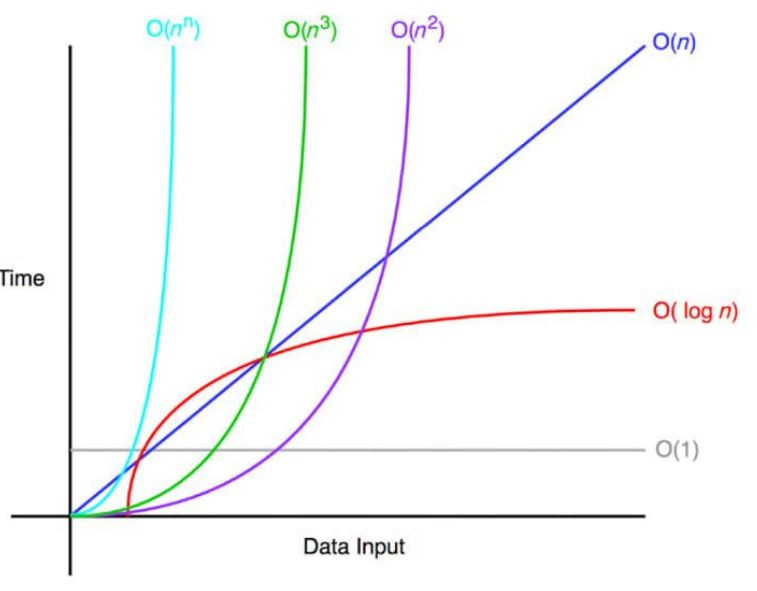

## Binary Search Basics

### Sequential Search

- Given an array of sorted numbers, return the index of a given number

  - [10, 30, 35, 42, 50, 55, 62]. Target = 50 ⇒ index = 4
  - [10, 30, 35, 42, 50, 55, 62]. Target = 70 ⇒ index = -1 (not found)

- Linear search offers a trivial solution for this problem

  - Iterate on the array element by element and compare against the target value

- Tip: Always make use of the special characteristics. The array is **sorted**
- How can we make use of this property?

### Analogy , Intuation


#### Binary search on a sorted array


### Test Cases

- Content
  - Array length: 1, 2, 3, N
  - Values: Consider unique or duplicate values. Maybe +ve and -ve values.
- Element exists
  - Test for the first and the last elements
  - Test for a few arbitrary elements: 13, 81, 55
- Element doesn’t exist
  - Test for element before the first number (-10)
  - Test for element after the last number (100)
  - Test for a few arbitrary elements within array elements: 15, 75
- Try to code.

### What is the time complexity??

```cpp
int binary_search(int val, vector<int> &arr)
{
    int start = 0, end = arr.size() - 1;
    while (start <= end)
    {
        int mid = (start + end) / 2;

        if (val == arr[mid])
            return mid;

        if (val > arr[mid])
            start = mid + 1;
        else if (val < arr[mid])
            end = mid - 1;
    }
    return -1;
}
```

### Logarithmi running time: log~2~(n)

- Assume N = 256
  - 256 ⇒ 128 ⇒ 64 ⇒ 32 ⇒ 16 ⇒ 8 ⇒ 4 ⇒ 2 ⇒ 1
  - log~2~(256) = 8: In only 8 steps. Log(2^32^) = 32 steps only!
- So the while loop will only take log(n) steps

  - log(n) == log~2~(n)

- Tip: if a range is reduced by ½ in each step ⇒ log~2~n
- Tip: if a range is reduced by ⅓ in each step ⇒ log~3~n
- some time complexity in order
  - O(1) < O(log(n)) < O(n) < O(nlog(n)) < O(n^2^) < O(n^2^log(n)) < O(n^3^)
  - O(nlog(n)) is called Log-Linear Complexity

#### Orders graph

- All inputs here use real
  values



### Tricky!

> Although the basic idea of binary search is comparatively straightforward, the
> details can be surprisingly tricky — Donald Knuth

- For many years, several known books contained the previous code
  - More than 20 years in the “Programming Pearls” book
  - More than 9 years in the Java programming language library
- What is wrong with the equation to compute the middle ?

- Intermidate overflow -> int mid = (start + end)/ 2;

- that is the interesting part it will overflow from 2 billon not 4 billion

### why and how to fix?

- Assume we use integer values for left and right
  - Integer limit is 2,147,483,647
- Assume the given array has a size 2 billions and we search for the last value
- At some point: both left and right will be around 2 billion
- Equation is (left+right) / 2
  - But left+right will be around 4 billion ⇒ overflow
- Fix: left + (right-left)/2

  - Another trivial way to compute the middle but based on the range length
    - Tip: whenever you just need the 'middle', use this equation
      - E.g. in merge sort and other divide and conquer algorithms

- another formula for mid = s+1/2 + e/2

#### Fixed code! O(logn) time - O(1) space

```cpp
int binary_search(int val, vector<int> &arr)
{
    int start = 0, end = arr.size() - 1;
    while (start <= end)
    {
        int mid = start + (end - start) / 2;

        if (val == arr[mid])
            return mid;

        if (val > arr[mid])
            start = mid + 1;
        else if (val < arr[mid])
            end = mid - 1;
    }
    return -1;
}

```

### Problem

- Given a sorted array of N unique values, and a huge number of queries (Q)
  - Return the index of the array or -1 if it doesn’t exist
- How to solve?
- Approach 1: For every query, do binary search on the array
  - O(qlogn)
  - Can we do better?
- Approach 2: Just put all the numbers in a hash table
  - Now we answer every query 1
  - O(q)
  - We did nothing with the array being sorted

### STL: Binary Searched based functions

```c++
vector<int> v{4, 2, 3, 2, 9, 2, 17, 17, 17, 20};

    // Finds the first element >= a given value
    vector<int>::iterator it = lower_bound(v.begin(), v.end(), 17);

    if (it != v.end())
    {
        cout << "First element >= 17 " << *it << " \n";
        cout << "\tIndex: " << it - v.begin() << " \n";
    }

    // Finds the first element > a given value
    it = upper_bound(v.begin(), v.end(), 20); // it == v.end() == true

    auto p = equal_range(v.begin(), v.end(), 17);
    cout << p.first - v.begin() << " " << p.second - v.begin() << "\n";
```

### STL : Balanced Binary Search Trees

- side note: STL `set` and `map` DS are implemented as
  `balanced binary search trees`.
- It is not a binary search like our code, but close concept
- Both data structures provide **lower_bound** and **upper_bound** functions
  - The same logic as the previous code
  - both are `log(n)`

### More bugs!

- To understand the several other possible bugs Donald Knuth meant, you will
  implement two variants in the homework
- LeetCode 34 - Find First and Last Position of Element in Sorted Array
  - Tip: if you know the first and last position of an element in a sorted array, you can work out how many times it occurs!
  - We can use stl: equal_range to solve it trivially
