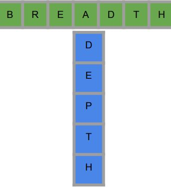
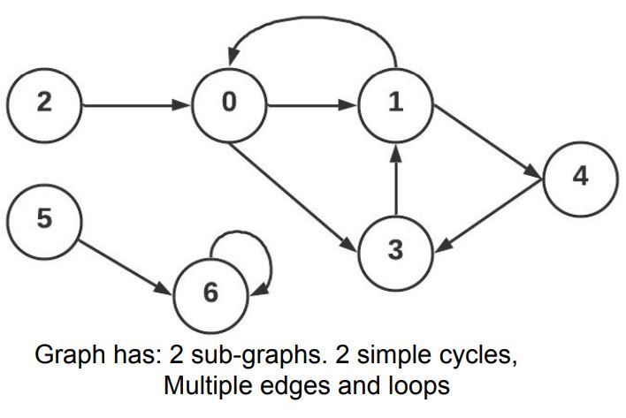

## DFS

#### Major Graph Representation

- **Adjacency Matrix**
- **Adjacency List**
- Adjacency set
- edge list

- Most common forms in standard algorithms Adjacency Matrix and List

#### Graph Traversal

There are many applications that require travering (visiting) graph nodes

- There are 2 popular techinques

  - DFS : recurive based techique (using built-in stack)
  - BFS: iterative based techique (using STL queue)

- These techiques work on all types of graphs(directed, weighted, multiple, edges, loops, etc)

- DFS looks like in order traversal on Binary Tree
- BFF looks like order traversal on tree

##### recurion levels of difficulty

- tally recursion: factorial
- chain recursion: fabonatchi or binary tree
- DFS: has list of neigbours, cycles
- DP:

##### T shaped Life Concept: Depth vs Breadth



##### Depth First Search

```cpp
DFS(node)
```

- DFS is a recurive algorithm for traversing a graph
- `it starts from a given node`.
- we can implement an iterative version using a stack.

###### pesudo code

- pick one of its edges
  - mark this neighbour as visited
  - recuse DFS (neighbour)
    - Do the same recursion logic
  - pick another edge : if available , and if its end hasn't been visited

##### Reachablility Problem



- we are given an unweighted directed graph, For every node S, list all of the nodes that are reachable from S
  - Node T is reachable from S if there is some path from S to T.
- Examples
  - Reachable(0): {1,3,4}
  - Reachable(1): {0,3,4}
  - Reachable(2): {0,1,3,4}
  - Reachable(3): {0,1,4}
  - Reachable(4): {0,1,3}
  - Reachable(5): {6}
  - Reachable(6): {}

#### Code: Graph is an adjacency list

```cpp
void dfs(GRAPH &graph, int node, vector<bool>visited) {
  visited[node] = true;
  for(int neighbor : graph[node])
  {
    if (!visited[neighbor]) {
      cout<<"\t we can reach "<<neighbor<<"\n";
      dfs(graph, neighbor, visited);
    }
  }
}

void reachablility(GRAPH &graph){
  int nodes = graph.size();
  for(int i = 0; i<nodes; i++)
  {
    vector<bool> visited(nodes); // RESET
    cout<<"Reachable set of node "<<i<<"\n";
    dfs(graph, i, visited);
  }
}
```

#### Trace Example

#### Another Traceing Example

#### Time Complexity

- DFS: O(N + M) (node and edges)
- Binary Tree (N + 2 N) node + edges = ~ 3N ~ N

##### DFS hw easy problems: leetcode_690_employee

- sol1: map IDs to 0 to N-1
- sol2: use unordered_map to represent each employee with number(id)
- there is no visited array because it a rooted tree

###### note

- DAG (Directed Uncycled Graph)
- Every rooted tree is DAG but not Every DAG is rooted tree
- rooted tree dosen't need to visited array
- DAG may need to visited array

---

## DFS on matrix

##### time complexity for DFS on matrix

- O(E+V) assume matrix 100 \* 100
- #of Nodes = 10k
- #of edges = 10k \* 4 = 40k
- around 50k == 5N == N
- so complexity is O(N)

- reachablility == connected components == flood fill

---

## Gragh Reduction

- tree edge
- back edge (cycle in same DFS call)
- forward edge(different path)
- cross edge(differnet or new DFS call)

#### timing

- prepare DFS hw 3 -3 med - hard
